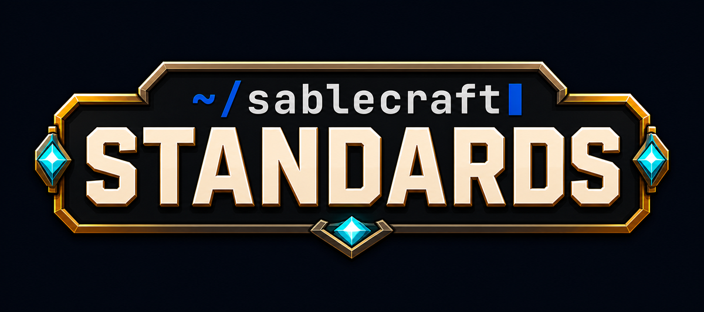

*Do you have Standards?*

**Server essentials, done properly.** The commands every Minecraft server ends up needing — flight,
god mode, homes, warps, teleports, and a built-in economy — for **NeoForge**, working on
**unmodified vanilla clients**.

| | |
|---|---|
| **Minecraft** | 26.1.x *(this branch)* — also **1.21.11** on `main` and **26.2.x** on `mc26.2` |
| **Loader** | NeoForge 26.1+ *(21.11+ on `main`, 26.2+ on `mc26.2`)* |
| **Java** | **25** — 21 on the 1.21.11 line. Minecraft's requirement, not ours |
| **Licence** | MIT |

Releases carry all three jars, each naming its Minecraft version:
`standards-1.3.0+mc26.1.2.jar`. Branch per version — see [`CROSS-VERSION.md`](CROSS-VERSION.md) for
why, and for what actually moved between the lines.

> **Status: shipping.** 1.3.0, released on all three lines, under a self-test of some 400 checks
> that runs on every server start. The command set is broad and the five APIs are built and driven
> by two sibling mods; a handful of commands are still open in [`COMMANDS.md`](COMMANDS.md), which
> is the live decision list rather than a roadmap for something unbuilt.

---

## Yet another essentials mod?

Yes. [Obligatory xkcd.](https://xkcd.com/927/) It is the joke in the name — and the mod id really
is just `standards`, which is either very cheeky or very annoying depending on how you feel about
searching for help on a mod called Create.

It exists anyway, because the incumbents have two specific flaws that are worth a whole mod:

**1. FTB Essentials has no `/top`.** The one command you want the moment you are lost in a cave.
And the classic implementation — read the heightmap — is wrong anywhere but the overworld surface:
in the Nether it sends you into the bedrock roof, and from a cave it overshoots to a surface you
did not ask for. Standards scans upward for the first place it is safe to stand, which is what
everybody actually meant.

**2. `/fly` and `/god` are toggles with no `on` or `off`.** Fine when a human types them. Useless to
anything else. A command block, a datapack, a shop, or an RPG skill that wants flight *on* for
twenty seconds and *off* afterwards cannot use a toggle — half the time it grounds the player
mid-air and does the exact opposite of its job.

So in Standards, **every switch takes an explicit state**:

```
/fly                    toggle your own          (the human default)
/fly on                 turn yours on
/fly Steve off          turn Steve's off
/fly @a on              turn everyone's on
```

The rest of the mod is the same instinct applied everywhere else: `/back` remembers a trail rather
than one slot, every message is in an editable catalogue, every command can be switched off
entirely, and there is a real economy API instead of a private ledger.

---

## What works today

| | |
|---|---|
| **Switches** | `/fly` `/god` `/vanish` (`/v`) `/tptoggle` `/msgtoggle` `/socialspy` — all with `on` / `off` / `toggle`, on yourself or on a selector |
| **Movement** | `/top` `/bottom` `/jump` (`/j`) `/back [steps]` `/spawn` `/setspawn` `/playerspawn` |
| **Homes & warps** | `/home` `/homes` `/sethome` `/delhome` · `/warp` `/warps` `/setwarp` `/delwarp` |
| **Teleport requests** | `/tpa` (`/call`) `/tpahere` `/tpaccept` (`/tpyes`) `/tpdeny` (`/tpno`) `/tpacancel` `/tpalist` · `/tpoffline` (`/otp`) |
| **Talking** | `/msg` (`/w` `/whisper` `/tell` `/pm` `/m`) `/r` (`/reply`) `/ignore` · `/mail send\|read\|clear` |
| **Away** | `/afk` (`/lurk`), with a configurable idle timer |
| **Yourself** | `/heal` `/feed` (`/eat`) `/rest` `/speed` |
| **Kits** | `/kit` `/kits` `/setkit` `/delkit` `/showkit` |
| **Stations** | `/craft` `/anvil` `/grindstone` `/enderchest` (`/ec`) `/trashcan` — *denied by default, see below* |
| **Money** | `/balance` (`/bal` `/money`) `/baltop` `/pay` `/eco give\|take\|set` |
| **Moderation** | `/tempban` `/mute` `/unmute` `/invsee` |
| **Gamemaster** | `/smite` |
| **Server** | `/gc` (`/tps` `/lag` `/mem`) · `/standards reload` `/standards economy` |

Teleport warmups, cooldowns, safe-landing search and the `/back` trail are shared by every one of
those, so they behave identically everywhere rather than each command growing its own half of the
feature.

### A few that are not what you expect

- **`/top` scans, it does not read the heightmap** — so it works in the Nether and from a cave.
- **`/tpa` narrates itself at both ends.** With a warmup configured, the requester is told the
  moment they are accepted and gets a ticking countdown; the acceptor is told when they arrive, or
  why they did not. Prompts carry clickable `[Accept]` / `[Deny]` buttons, which work on vanilla
  clients.
- **`/vanish` genuinely hides you** — unpaired from other players' entity trackers, off the tab
  list, and ignored by mob AI.
- **Portable stations are denied to everyone, including operators, by default.** That is the design:
  a workbench you can open anywhere is an ability to be granted, not a utility to assume. A builder
  rank gets `standards.craft`; a blacksmith class gets `standards.anvil` from a LegendQuest skill.
- **`/setkit <name> armour|hotbar|inventory|all`** captures what you are wearing and carrying, so
  kits are made by equipping yourself rather than by writing item ids into a file.
- **`/back` is a stack, not a bookmark.** Every teleport pushes an entry and `/back` pops the
  newest, so `/back <n>` reaches further — and **`/back list`** shows what is actually on it, with
  the distance and the command that made each stop. Other mods' teleports are labelled too, without
  those mods knowing: the label is taken at the dispatcher.
- **`/pay` takes a reason** — `/pay Steve 500 half of what we dug` — carried into the mailbox when
  they are offline, so a payment made on Tuesday still explains itself on Friday.
- **`/group disband` is separate from `/group leave`.** An owner walking out would take everybody's
  shared homes with them, which is too much for a word one keystroke from "I am done with this". An
  owner *alone* still just leaves.

---

## Vanilla clients

Standards is **server-side**. Install it on the server and every player gets everything, whether or
not they have a single mod installed. There is an optional client channel reserved for future
conveniences, and nothing in it will ever be load-bearing.

**One stated consequence.** If a chat decorator is registered (by Standards or by another mod),
those chat lines are composed on the server and sent as **system messages**, which carry no sender
— so client-side chat reporting, client-side blocking and vanilla's hover card on the name do not
apply to them. A decorator that returns nothing leaves chat entirely alone, so this affects only
lines actually being decorated. `/ignore` and the server log
are handled by Standards directly and still work. Undecorated chat is untouched and still vanilla.
The trade is deliberate: formatting that works for everyone beats signing that only ever worked
for players who had mods. See [CHAT-API.md](CHAT-API.md#the-cost-a-decorated-line-is-not-signed).

---

## Permissions, and one thing to know first

Standards asks NeoForge's `PermissionAPI` for every check, so it works the same with LuckPerms, with
any other handler, or with none at all.

**With no permissions mod**, NeoForge answers every question with the node's own default — op-gated
nodes for operators, everyone-nodes for everyone, and *nothing grantable*.

Standards now ships a handler for exactly that server. One line in `neoforge-server.toml`:

```toml
permissionHandler = "standards:permissions"
```

and `/rank` appears: groups with inheritance, per-player grants, `standards.home.*` wildcards, an
explicit deny that beats everything, and a default group everybody is in. It is **dormant unless
you choose it** — install LuckPerms and nothing here changes. If you outgrow it, install LuckPerms
and change that one line back. See [`PERMISSIONS.md`](PERMISSIONS.md).

Its groups are also *groups*: put somebody in `moderator` and they get the nodes, a chat tag, and
visibility to any other mod through the groups API, in one edit. That is the half LuckPerms cannot
do, and the reason this exists rather than being a smaller copy of it.

Without either, five commands default to **nobody** on purpose, because they are capabilities a
mod hands out temporarily rather than things every player has:

`/craft` `/anvil` `/grindstone` `/enderchest` `/trashcan`

On a server with no way to grant anything, "nobody" means nobody, ever — and the commands simply do
not appear. If that is your server, say who they are for:

```toml
stationAccess = "ops"        # or "everyone", or the default "nobody"
backOnDeathAccess = "nobody" # /back returning you to where you died
```

A permissions mod overrides both in either direction; these only decide the answer where nothing
else can.

## Permissions

Standards registers nodes through NeoForge's `PermissionAPI`, so **[LuckPerms]** (which has a
NeoForge build) controls them per group with no extra configuration.

With no permissions manager installed, the defaults are what a fresh server should do: the everyday
conveniences are open to everyone, and anything that changes the rules of the game — or acts on
*another* player — needs op.

| Node | Default |
|---|---|
| `standards.home` `standards.sethome` `standards.delhome` | everyone |
| `standards.warp` `standards.back` `standards.top` | everyone |
| `standards.balance` `standards.baltop` `standards.pay` | everyone |
| `standards.fly` `standards.god` `standards.jump` | op |
| `standards.fly.others` `standards.god.others` `standards.balance.others` | op |
| `standards.setwarp` `standards.eco` `standards.admin` | op |
| `standards.teleport.instant` `standards.teleport.nocooldown` | op |
| `standards.back.ondeath` | **nobody** — returning to your corpse is a gameplay decision |

**Home limits** are numbered nodes, EssentialsX-style, so ranks work the way you already expect:

```
standards.home.limit.3            # three homes
standards.home.limit.10           # ten
standards.home.limit.unlimited    # as many as they like
```

The highest granted number wins. Without one, `homes.defaultLimit` from the config applies.

---

## Configuration

`config/standards-common.toml`. The switches under `[commands]` decide what exists at all — a
command that is off is **not registered**, so it does not appear in tab-complete either. (Those
need a restart; everything else applies live.)

Worth knowing about:

| Setting | Does |
|---|---|
| `teleport.warmupSeconds` | Stand still before a teleport fires. `cancelOnDamage` is the half that stops combat-logging. |
| `teleport.safeSearchRange` | How far to look for a safe landing. `0` arrives exactly where asked. |
| `teleport.backHistory` | How long the `/back` trail is. |
| `homes.defaultLimit` | Homes without a permission node. `-1` is unlimited. |
| `economy.currencyName*` / `currencySymbol` | `25 coins`, or `$25`. |
| `economy.preferOwnLedger` | Insist on our ledger even if another economy mod is installed. |

### Messages

Every player-facing string lives in `config/standards/messages.yml`, written in full on first run.
Edit it for translation, for tone, or to re-skin the vocabulary entirely:

```yaml
term.balance: "credits"
term.warp: "jump point"
msg.home.went: "&bBeaming down to &f{name}&b..."
```

`&` colour codes work everywhere, `{placeholders}` are filled at runtime, and deleted keys fall
back to the defaults — so trimming the file to just your changes is fine, and an update that adds
messages will never break it. `/standards reload` re-reads it.

**The welcome message knows who it is greeting.** `/motd`, `/rules` and `/info` are numbered runs
(`msg.motd.1`, `.2`, …, printed until a number is missing) and take `{player}`, `{name}`, `{rank}`,
`{playtime}`, `{world}`, `{online}` and `{max}`:

```yaml
msg.motd.1: "&7Welcome back, &f{player}&7. You are &f{rank}&7."
```

A placeholder that does not exist is reported in the log rather than shown to a player, so a typo
is findable instead of embarrassing. The full list is in the header of `messages.yml` itself.

---

## The economy

Standards ships a ledger because NeoForge has no Vault and no clear leader among the economy mods
that do exist. But it does not assume it is the only one: the ledger sits behind
`EconomyProvider`, registered at a **negative** priority, and steps aside the moment a dedicated
economy mod registers one of its own.

For mod authors — how to spend money, and how to provide it — see
**[`ECONOMY-API.md`](ECONOMY-API.md)**.

```java
if (Economy.isAvailable()) {
    Economy.deposit(player.getUUID(), 25.0D, "mymod:reward");
}
```

`/standards economy` says which ledger is actually holding the money, which is the first question
whenever one misbehaves.

---

## For other mods

Standards is built to be a meeting point rather than a silo. Six seams, all soft dependencies, and every one of them now has a real consumer:

| API | For | Doc |
|---|---|---|
| `api.economy.Economy` | spending and providing money | [`ECONOMY-API.md`](ECONOMY-API.md) |
| `api.chat.Chat` | chat name prefixes and suffixes, from several mods at once | [`CHAT-API.md`](CHAT-API.md) |
| `api.PlayerSwitches` / `api.Stations` | driving `/fly`, `/god`, `/vanish` and the workstations from code | — |
| `api.groups.Groups` / `api.groups.Claims` | group membership by kind, and chunk claim queries — driven by [Factions ReForged](https://github.com/Sablednah/Factions-ReForged), and by Standards' own permission ranks as `standards:role` | [`GROUPS-API.md`](GROUPS-API.md) |
| `api.combat.Combat` | combat tagging, so nothing lets a player walk out of a fight — and resolving who was really behind a hit, through arrows and pets | [`COMBAT-API.md`](COMBAT-API.md) |
| `api.vanish.Vanish` | whether a player is hidden, so a mod drawing a nameplate or health bar on them can take it down — a floating name over nobody gives a vanish away | [`VANISH-API.md`](VANISH-API.md) |

The last one exists because a LegendQuest skill granting flight should not have to build a command
string and hope: the skill is already the authority, so it calls in directly and skips the
permission check that gates the typed command.

---

## Mods built on this

- **[Factions ReForged](https://github.com/Sablednah/Factions-ReForged)** — chunk claims, particle
  borders, diplomacy and a faction bank. The first real consumer of the groups, claims, chat and
  economy seams, and the reason several of them got fixed.

## Building from source

Needs a JDK 21.

```bash
./gradlew build                   # -> build/libs/standards-<version>+mc<mcver>.jar
./gradlew runServer               # dev server on port 25569
./gradlew runServer -Pselftest    # the same, with the built-in smoke test
```

---

## Where to look next

- [`CHANGELOG.md`](CHANGELOG.md) — what changed, and why it changed.
- [`CURSEFORGE.md`](CURSEFORGE.md) — the project description, kept here so it is versioned with the mod it describes.
- [`CURSEFORGE-COMMANDS.md`](CURSEFORGE-COMMANDS.md) — every command, with its permission node and why it behaves as it does.
- [`COMMANDS.md`](COMMANDS.md) — the full EssentialsX / FTB catalogue with keep-or-skip notes.
- [`ECONOMY-API.md`](ECONOMY-API.md), [`CHAT-API.md`](CHAT-API.md),
  [`GROUPS-API.md`](GROUPS-API.md) — the seams other mods build on.
- [`COMBAT-API.md`](COMBAT-API.md) — combat tagging, and how another mod hooks it.
- [`NODES.md`](NODES.md) — **every permission node**, with its default. Generated from the source
  by `python3 scripts/nodes.py`, so it cannot drift into fiction.
- [`PERMISSIONS.md`](PERMISSIONS.md) — the built-in permission handler: `/rank`, the resolution
  order, and what LuckPerms does when both are installed.
- [`CROSS-VERSION.md`](CROSS-VERSION.md) — living on several Minecraft lines at once.

## Credits

Inspired by [Essentials](https://dev.bukkit.org/projects/essentials) / EssentialsX and by
[FTB Essentials](https://www.curseforge.com/minecraft/mc-mods/ftb-essentials) — read for intent,
rebuilt from scratch. No code is taken from either.

Part of the SableCraft family, alongside
[MobHealth](https://github.com/Sablednah/MobHealth-Forge),
[LegendQuest ReForged](https://github.com/Sablednah/LegendQuest-ReForged),
ZombieMod and CityWorld ReForged.

MIT licensed. © 2026 Sablednah.

[LuckPerms]: https://luckperms.net/
